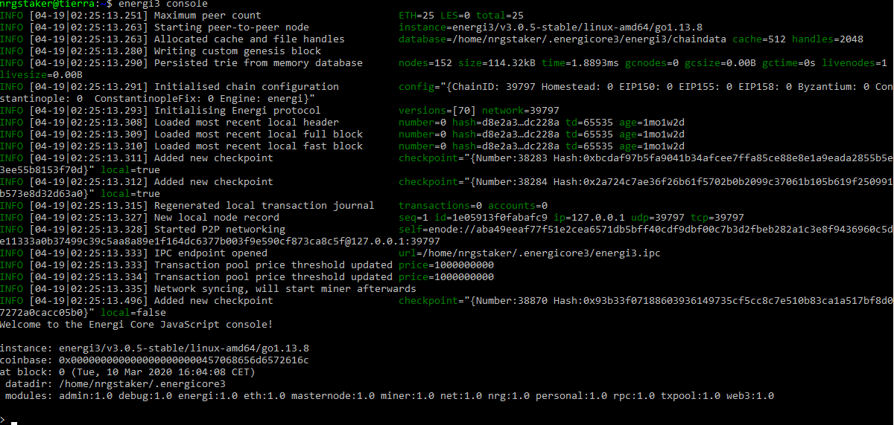
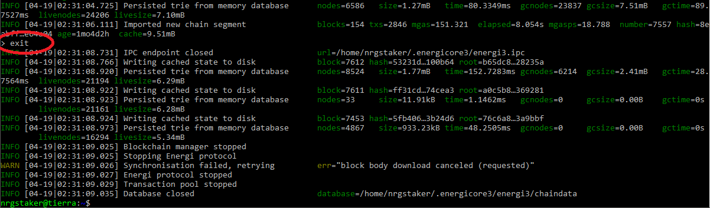
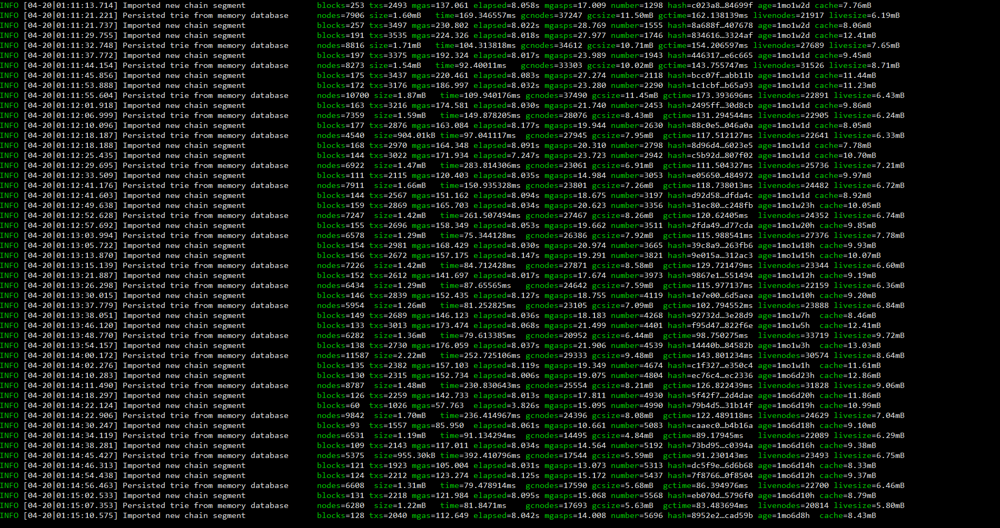
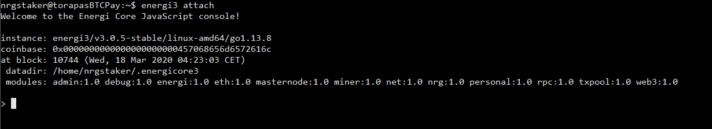
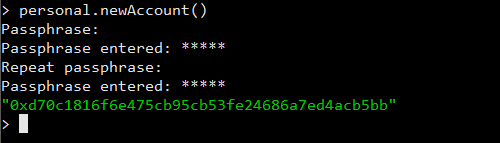
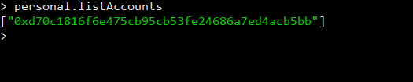
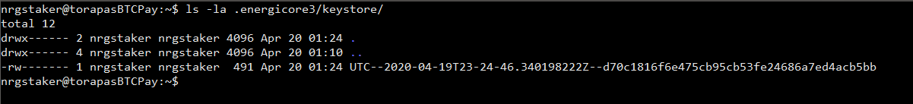
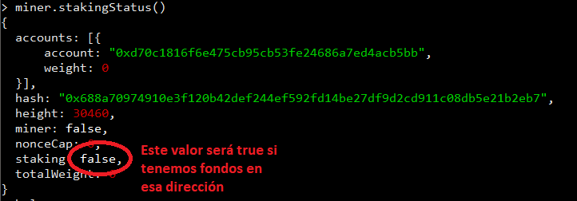

# Instalación de un nodo de Energy en un servidor VPS

## Configuración del servidor

Lo primero que deberemos hacer es establecer la configuración del servidor. Nos vamos a basar en un servidor GNU/Linux Ubuntu LTS 18.04.

Los pasos a seguir una vez tenemos el servidor en marcha y nos hemos conectado por SSH serán los siguientes:

1. Nos logueamos como el usuario root:

    ```
    sudo su -
    ```

2. Actualizaremos el servidor e instalamos todos los paquetes necesarios para instalar el nodo. Para ello ejecutaremos los siguientes comandos:

    ```
    apt-get update && apt-get -y upgrade && apt-get install -y wget screen
    ```

3. Crearemos el usuario que correrá el nodo/stake de Energy (no debe ser root):

    - Creamos el usuario

    ```
    adduser nrgstaker
    ```

    Durante el proceso deberemos establecer la contraseña del usuario nuevo. El resto de campos se pueden quedar en blanco.

    - Establecemos sus permisos

    ```
    usermod -aG sudo nrgstaker
    ```

4. Configuramos el usuario nuevo para que corra el nodo/stake de Energy:

    - Nos logueamos con el usuario nuevo

    ```
    su - nrgstaker
    ```

    - Añadimos al fichero .bashrc las variables necesarias

    ```
    cd $HOME
    echo "export PATH=$PATH:$HOME/energi3/bin" >> .bashrc
    echo "unset HISTFILE" >> .bashrc
    exit
    ```

    - Nos volvemos a logar con el usuario nuevo

    ```
    su - nrgstaker
    ```

    - Eliminamos el fichero que conserva el histórico de comandos

    ```
    cd $HOME
    rm .bash_history
    exit
    ```

5. Configuramos el nodo de Energy (logados como root):

    1. Establecemos la gestión de los ficheros de LOG. Para ello creamos un nuevo fichero:

    ```
    nano /etc/logrotate.d/energi3
    ```

    y lo rellenamos con el siguiente contenido

    ```
    /home/nrgstaker/.energicore3/log/*.log {
        su nrgstaker nrgstaker
        rotate 3
        minsize 100M
        copytruncate
        compress
        missingok
    }
    ```

    Guardaremos el fichero pulsando **CTRL+X** pulsando **Y** y **ENTER** a continuación para guardarlo.

    2. Reiniciamos el servidor para activar los cambios:

    ```
    reboot now
    ```

6. Securizamos el servidor estableciendo las reglas necesarias en el firewal (logados con el usuario root):

    ```
    apt-get install ufw -y
    ufw allow ssh/tcp
    ufw limit ssh/tcp
    ufw allow 39797/tcp
    ufw allow 39797/udp
    ufw logging on
    ufw enable
    ```

## Instalación de la aplicación para el nodo de Energy

1. Nos logamos con el usuario nrgstaker

    ```
    su - nrgstaker
    ```

2. Descargamos y extraemos la aplicación del nodo de Energy

    ```
    cd $HOME
    wget https://s3-us-west-2.amazonaws.com/download.energi.software/releases/energi3/3.0.5/energi3-3.0.5-linux-amd64.tgz
    tar xvfz energi3-3.0.5-linux-amd64.tgz
    mv energi3-3.0.5-linux-amd64 energi3
    rm energi3-3.0.5-linux-amd64.tgz
    mkdir -p energi3/js
    ```

3. Comprobamos que la instación ha sido correcta

    ```
    energi3 console
    ```

    Obtendremos una imágen parecida a esta:

    

    En este momento el nodo empezará a sincronizar y puede tardar horas (o días). Para parar el proceso escribiremos:

    ```
    exit
    ```

    y pulsaremos **ENTER**

    

## Lanzamos el nodo en modo desatendido

Para que el nodo funcione en modo desatendido deberemos logarnos con el usuario nrgstaker y ejecutar el siguiente comando:

```
screen -dmS Energy energi3 --verbosity 3
```

De esta manera el nodo se pondrá a trabajar por su cuenta. Para comprobar su funcionamiento podremos excribir:

```
screen -r
```

lo cual nos abrirá un terminal virtual donde está corriendo el nodo (como en la imágen):



Si queremos parar el nodo pulsaremos **CTRL+C** y si queremos dejarlo funcionando por su cuenta pulsaremos **CTRL+A+D**.

## Interactuamos con el nodo

Para poder lanzar comando en el nodo deberemos ejecutar:

```
energi3 attach
```

Nos abrirá una consola de comandos donde podremos ejecutar comandos sobre el nodo:



Ahora ya podremos crear una cartera, depositar los fondos y empezar a hacer staking:

## Crear la cartera

Dentro de la consola de Energy usaremos el siguiente comando para crear una nueva cartera:

```
personal.newAccount()
```

Se nos pedirá que introduzcamos una **Passphrase** o contraseña para la cartera. Esta nos servirá tanto para hacer staking como para manejar los fondos de la cartera.



La dirección que obtenemos como resultado será donde deberemos mandar los fondos para realizar el staking.

Podemos crear tantas cuentas como queramos, simplemente repitiendo el comando anterior. Para obtener un listado de todas nuestras cuentas es el siguiente:

```
personal.listAccounts
```



## Realizar copia de seguridad de las carteras creadas

Cada vez que creamos una cartera, Energy crea un fichero dentro de la carpeta **\$HOME/.energicore3/keystore** para realizar una copia de ellas simplemente deberemos copiar todos los ficheros de esa carpeta en otro ordenador/almacenamiento externo.



## Realizar Staking en nuestro nuevo nodo

Para realizar staking deberemos seguir los siguientes pasos:

1. Depositar fondos en la cartera

    Enviaremos un mínimo de 1 NRG a la dirección de la cartera obtenida en el momento de crearla.

2. Entraremos en la consola de comandos de Energy (deberemos hacerlo desde el usuario nrgstaker)

    ```
    energi3 attach
    ```

3. Desbloqueamos la cartera para stacking:

    ```
    personal.unlockAccount('DIRECCION_GENERADA', null, 0, true)
    ```

    Deberemos introducir la contraseña usada para crear la cartera.

    

4. Comprobamos si está funcionando el staking (al menos debemos tener 1NRG en esa dirección)

    ```
    miner.stakingStatus()
    ```

    
